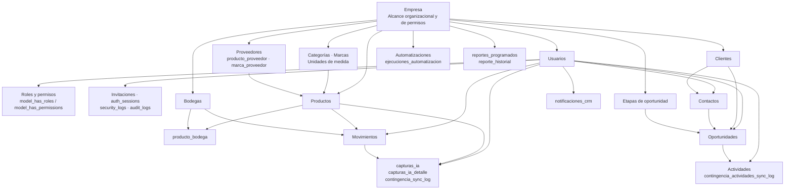

# Diagrama de clases — Base de datos FidelOS CRM

Este diagrama refleja las migraciones activas de `backend/database/migrations`
como una única base de datos. `Empresa` organiza los registros y el alcance de
permisos RBAC mediante `empresa_id`, conectando CRM, inventario, seguridad, IA
y reportes.
Se incluyen todas las tablas de dominio y soporte de la aplicación; se omiten las
tablas técnicas estándar de Laravel (`cache`, `cache_locks`, `jobs`,
`job_batches`, `failed_jobs`, `sessions` y `password_reset_tokens`) porque no
forman parte del modelo de negocio.

## Vista integrada de la base de datos actual

> Si el visor Markdown no tiene Mermaid habilitado, usa el diagrama SVG anterior,
> que se muestra como una imagen normal. El código Mermaid se conserva debajo
> para poder editarlo.

Cada bloque representa tablas de la misma base de datos, y las flechas muestran
las relaciones principales existentes. No hay agrupaciones que representen
bases, módulos o esquemas independientes.

## Diagrama detallado de tablas y relaciones

```mermaid
classDiagram
direction TB

class Empresa { +id +nombre +estado }
class Usuario { +id +empresa_id? +invited_by? +name +email +is_platform_admin +is_active }
class Rol { +id +empresa_id? +name +guard_name +estado }
class Permiso { +id +name +guard_name }
class Invitacion { +id +empresa_id +role_id? +invited_by +email +token_hash +expires_at +accepted_at? }
class AuthSession { +id +user_id +refresh_token_hash +expires_at +revoked_at? }
class SecurityLog { +id +user_id? +email +success +reason? +created_at }
class AuditLog { +id +uuid +empresa_id +usuario_id? +modulo +accion +auditable_type? +auditable_id? }

class Cliente { +id +empresa_id +nombre +nit? +contacto? +email? +estado }
class Proveedor { +id +empresa_id +nombre +nit? +contacto? +email? +estado }
class Categoria { +id +empresa_id +nombre +descripcion? +estado }
class Marca { +id +empresa_id +nombre +estado }
class UnidadMedida { +id +empresa_id +nombre +estado }
class Producto { +id +empresa_id +categoria_id? +marca_id? +unidad_medida_id? +codigo? +nombre +costo +precio +stock_actual +stock_estado +inhabilitado_por_stock +estado }
class ProductoProveedor { +id +empresa_id +producto_id +proveedor_id +es_principal +precio_compra? +codigo_proveedor? +estado }
class MarcaProveedor { +id +empresa_id +marca_id +proveedor_id }
class Bodega { +id +empresa_id +nombre +es_principal +estado }
class ProductoBodega { +id +empresa_id +producto_id +bodega_id +stock_actual }
class Movimiento { +id +empresa_id +producto_id +bodega_id? +usuario_id? +proveedor_id? +tipo +cantidad +stock_anterior +stock_nuevo +estado }

class CapturaIA { +id +uuid +empresa_id +usuario_id? +idempotency_key? +tipo +movimiento_tipo +estado }
class CapturaIADetalle { +id +captura_id +producto_id? +movimiento_id? +nombre_detectado +cantidad_detectada +confianza +estado }
class ContingenciaSyncLog { +id +empresa_id +usuario_id? +producto_id? +operacion_id +tipo +procesado_at }
class ContingenciaActividadSyncLog { +id +empresa_id +usuario_id? +actividad_id? +operacion_id +procesado_at }
class ReporteProgramado { +id +empresa_id +usuario_id? +nombre +tipo_reporte +formato +frecuencia +estado }
class ReporteHistorial { +id +uuid +empresa_id +usuario_id? +tipo_reporte +formato +total_filas? +created_at }

class EtapaOportunidad { +id +empresa_id +nombre +orden +probabilidad +tipo +estado }
class Contacto { +id +empresa_id +cliente_id? +responsable_id? +nombre +email? +estado +convertido_at? }
class Oportunidad { +id +empresa_id +cliente_id +contacto_id? +etapa_oportunidad_id +responsable_id? +nombre +monto +probabilidad }
class Actividad { +id +empresa_id +cliente_id? +contacto_id? +oportunidad_id? +responsable_id? +creado_por_id? +tipo +asunto +estado }
class Automatizacion { +id +empresa_id +nombre +evento +filtros? +acciones +activa }
class EjecucionAutomatizacion { +id +empresa_id +automatizacion_id +evento +entidad_tipo +entidad_id +clave_idempotencia +estado }
class NotificacionCrm { +id +empresa_id +usuario_id? +tipo +titulo +leida_at? }

Empresa "1" --> "*" Usuario
Empresa "1" --> "*" Rol
Empresa "1" --> "*" Invitacion
Empresa "1" --> "*" AuditLog
Empresa "1" --> "*" Cliente
Empresa "1" --> "*" Proveedor
Empresa "1" --> "*" Categoria
Empresa "1" --> "*" Marca
Empresa "1" --> "*" UnidadMedida
Empresa "1" --> "*" Producto
Empresa "1" --> "*" ProductoProveedor
Empresa "1" --> "*" MarcaProveedor
Empresa "1" --> "*" Bodega
Empresa "1" --> "*" ProductoBodega
Empresa "1" --> "*" Movimiento
Empresa "1" --> "*" CapturaIA
Empresa "1" --> "*" ContingenciaSyncLog
Empresa "1" --> "*" ContingenciaActividadSyncLog
Empresa "1" --> "*" ReporteProgramado
Empresa "1" --> "*" ReporteHistorial
Empresa "1" --> "*" EtapaOportunidad
Empresa "1" --> "*" Contacto
Empresa "1" --> "*" Oportunidad
Empresa "1" --> "*" Actividad
Empresa "1" --> "*" Automatizacion
Empresa "1" --> "*" EjecucionAutomatizacion
Empresa "1" --> "*" NotificacionCrm

Usuario "0..1" --> "*" Usuario : invited_by
Usuario "1" --> "*" AuthSession
Usuario "0..1" --> "*" SecurityLog
Usuario "1" --> "*" Invitacion : invited_by
Rol "0..1" --> "*" Invitacion
Rol "0..*" --> "0..*" Permiso : role_has_permissions
Rol "0..*" --> "0..*" Usuario : model_has_roles
Usuario "0..*" --> "0..*" Permiso : model_has_permissions

Categoria "0..1" --> "*" Producto
Marca "0..1" --> "*" Producto
UnidadMedida "0..1" --> "*" Producto
Producto "1" --> "*" ProductoProveedor
Proveedor "1" --> "*" ProductoProveedor
Marca "1" --> "*" MarcaProveedor
Proveedor "1" --> "*" MarcaProveedor
Producto "1" --> "*" ProductoBodega
Bodega "1" --> "*" ProductoBodega
Producto "1" --> "*" Movimiento
Bodega "0..1" --> "*" Movimiento
Proveedor "0..1" --> "*" Movimiento
Usuario "0..1" --> "*" Movimiento

Usuario "0..1" --> "*" CapturaIA
CapturaIA "1" --> "*" CapturaIADetalle
Producto "0..1" --> "*" CapturaIADetalle
Movimiento "0..1" --> "*" CapturaIADetalle
Usuario "0..1" --> "*" ContingenciaSyncLog
Producto "0..1" --> "*" ContingenciaSyncLog
Usuario "0..1" --> "*" ContingenciaActividadSyncLog
Usuario "0..1" --> "*" AuditLog
Usuario "0..1" --> "*" ReporteProgramado
Usuario "0..1" --> "*" ReporteHistorial

Cliente "0..1" --> "*" Contacto
Cliente "1" --> "*" Oportunidad
Contacto "0..1" --> "*" Oportunidad
EtapaOportunidad "1" --> "*" Oportunidad
Usuario "0..1" --> "*" Contacto : responsable
Usuario "0..1" --> "*" Oportunidad : responsable
Cliente "0..1" --> "*" Actividad
Contacto "0..1" --> "*" Actividad
Oportunidad "0..1" --> "*" Actividad
Usuario "0..1" --> "*" Actividad : responsable
Usuario "0..1" --> "*" Actividad : creado_por
Actividad "0..1" --> "*" ContingenciaActividadSyncLog
Automatizacion "1" --> "*" EjecucionAutomatizacion
Usuario "0..1" --> "*" NotificacionCrm

note for Rol "RBAC de Spatie con teams activado. roles.empresa_id y<br/>model_has_roles/model_has_permissions.empresa_id son FK a Empresa;<br/>Permiso es un catálogo global."
note for Empresa "Única base de datos. empresa_id relaciona los registros<br/>con su empresa; RBAC usa ese mismo alcance para roles y permisos.<br/>No existen bases separadas por módulo ni por empresa."
note for ProductoProveedor "Entidad asociativa con atributos propios.<br/>UNIQUE(producto_id, proveedor_id)."
note for MarcaProveedor "Entidad asociativa.<br/>UNIQUE(marca_id, proveedor_id)."
note for ProductoBodega "Base estructural para multi-almacén.<br/>UNIQUE(producto_id, bodega_id)."
note for Movimiento "cantidad es positiva; tipo define la dirección.<br/>proveedor_id es la FK actual; proveedor (texto) se conserva<br/>como dato histórico."
note for CapturaIA "UNIQUE(empresa_id, idempotency_key).<br/>El UUID es el identificador externo estable."
note for ContingenciaSyncLog "Ledger idempotente: UNIQUE(empresa_id, operacion_id)."
note for ContingenciaActividadSyncLog "Ledger idempotente de las actividades offline:<br/>UNIQUE(empresa_id, operacion_id)."
note for EjecucionAutomatizacion "entidad_tipo/entidad_id es una referencia polimórfica<br/>sin FK en la base de datos. UNIQUE(automatizacion_id, clave_idempotencia)."
note for AuditLog "auditable_type/auditable_id es una referencia polimórfica<br/>sin FK. Es inmutable: solo tiene created_at."
```

## Reglas y límites relevantes

- `empresa_id` relaciona los registros con `Empresa`. Todas las entidades de
  negocio que aparecen relacionadas directamente con `Empresa` tienen una FK
  real a `empresas`; RBAC utiliza ese alcance en roles y asignaciones.
  `users.empresa_id` y `roles.empresa_id` son opcionales para permitir
  administración de plataforma.
- Los catálogos y terceros usan `estado` para desactivación lógica; no usan
  `deleted_at`. `clientes` y `proveedores` tienen `nit` único por empresa.
- `productos.stock_actual` continúa siendo la fuente operativa de verdad. La
  migración creó y pobló `producto_bodega`, pero el servicio de inventario aún
  no opera saldos por bodega.
- Las relaciones de Spatie con usuarios son polimórficas en la tabla física
  (`model_type`, `model_id`); el diagrama muestra el caso de uso actual con
  `Usuario`.
