# Diagrama de clases — Base de datos FidelOS CRM

```mermaid
classDiagram
direction LR

class Empresa { +id +nombre }
class Usuario { +id +empresa_id +name +email +is_active }
class Cliente { +id +empresa_id +nombre +nit +estado }
class Contacto { +id +empresa_id +cliente_id +responsable_id +nombre +email +estado +convertido_at }
class EtapaOportunidad { +id +empresa_id +nombre +orden +probabilidad +tipo }
class Oportunidad { +id +empresa_id +cliente_id +contacto_id +etapa_oportunidad_id +responsable_id +nombre +monto +probabilidad +fecha_cierre_estimada }
class Actividad { +id +empresa_id +cliente_id +contacto_id +oportunidad_id +responsable_id +creado_por_id +tipo +asunto +estado +programada_para +completada_at }
class Automatizacion { +id +empresa_id +nombre +evento +acciones +activa }
class EjecucionAutomatizacion { +id +empresa_id +automatizacion_id +entidad_tipo +entidad_id +clave_idempotencia +estado }
class NotificacionCrm { +id +empresa_id +usuario_id +tipo +titulo +leida_at }
class Categoria { +id +empresa_id +nombre +estado }
class Marca { +id +empresa_id +nombre +estado }
class UnidadMedida { +id +empresa_id +nombre +estado }
class Producto { +id +empresa_id +categoria_id +marca_id +unidad_medida_id +nombre +stock_actual }
class Bodega { +id +empresa_id +nombre +es_principal +estado }
class ProductoBodega { +id +empresa_id +producto_id +bodega_id +stock_actual }
class Movimiento { +id +empresa_id +producto_id +bodega_id +usuario_id +tipo +cantidad +stock_anterior +stock_nuevo }
class ContingenciaSyncLog { +id +empresa_id +usuario_id +producto_id +operacion_id }
class ContingenciaActividadSyncLog { +id +empresa_id +usuario_id +actividad_id +operacion_id }
class Rol { +id +empresa_id +name +guard_name }
class Permiso { +id +name +guard_name }

Empresa "1" --> "*" Usuario
Empresa "1" --> "*" Rol
Rol "0..*" --> "0..*" Usuario : model_has_roles
Rol "0..*" --> "0..*" Permiso : role_has_permissions
Usuario "0..*" --> "0..*" Permiso : model_has_permissions (directo)
Empresa "1" --> "*" Cliente
Empresa "1" --> "*" Contacto
Empresa "1" --> "*" EtapaOportunidad
Empresa "1" --> "*" Oportunidad
Empresa "1" --> "*" Actividad
Empresa "1" --> "*" Automatizacion
Empresa "1" --> "*" EjecucionAutomatizacion
Empresa "1" --> "*" NotificacionCrm
Empresa "1" --> "*" Categoria
Empresa "1" --> "*" Marca
Empresa "1" --> "*" UnidadMedida
Empresa "1" --> "*" Producto
Empresa "1" --> "*" Bodega
Empresa "1" --> "*" Movimiento
Empresa "1" --> "*" ContingenciaSyncLog
Empresa "1" --> "*" ContingenciaActividadSyncLog
Cliente "0..1" --> "*" Contacto
Cliente "1" --> "*" Oportunidad
Contacto "0..1" --> "*" Oportunidad
EtapaOportunidad "1" --> "*" Oportunidad
Usuario "0..1" --> "*" Contacto : responsable
Usuario "0..1" --> "*" Oportunidad : responsable
Usuario "0..1" --> "*" Actividad : responsable
Usuario "0..1" --> "*" Actividad : creador
Oportunidad "0..1" --> "*" Actividad
Contacto "0..1" --> "*" Actividad
Cliente "0..1" --> "*" Actividad
Automatizacion "1" --> "*" EjecucionAutomatizacion
Usuario "0..1" --> "*" NotificacionCrm
Categoria "0..1" --> "*" Producto
Marca "0..1" --> "*" Producto
UnidadMedida "0..1" --> "*" Producto
Producto "1" --> "*" Movimiento
Producto "0..*" --> "0..*" Bodega : producto_bodega
Bodega "0..1" --> "*" Movimiento
Usuario "0..1" --> "*" Movimiento
Producto "0..1" --> "*" ContingenciaSyncLog
Usuario "0..1" --> "*" ContingenciaSyncLog
Actividad "0..1" --> "*" ContingenciaActividadSyncLog
Usuario "0..1" --> "*" ContingenciaActividadSyncLog

note for Rol "RBAC ya implementado (spatie/laravel-permission, no de<br/>cero): Rol es subclase de Spatie\Permission\Models\Role,<br/>Permiso es el Permission de Spatie sin subclasear. 'teams'<br/>activado con team_foreign_key = empresa_id, así que Rol<br/>vive por empresa aunque Permiso es catálogo global. Punto<br/>11 del review ya estaba resuelto en código, solo faltaba<br/>en el diagrama."
note for Contacto "cliente_id es 0..1: un Contacto nace como lead sin<br/>Cliente y se vuelve 1 al convertirse (ver convertido_at)."
note for Actividad "responsable_id y creado_por_id son dos FK independientes<br/>a Usuario (mismo o distinto usuario, cardinalidad propia<br/>cada una) — no una única relación fusionada."
note for EjecucionAutomatizacion "entidad_tipo/entidad_id es referencia polimórfica<br/>sin integridad referencial en BD (sin FK real) — limitación<br/>conocida, a resolver si se necesita integridad estricta."
note for Movimiento "cantidad siempre es una magnitud positiva; la dirección<br/>(sumar/restar contra stock_actual) la decide InventoryService<br/>según tipo (Salida resta, resto suma por defecto; Ajuste recibe<br/>direccion explícita). stock_actual se sincroniza de forma<br/>atómica (transacción + lockForUpdate sobre Producto) en el<br/>mismo Service que crea el Movimiento — nunca se escribe por<br/>fuera de ese camino. Trazabilidad de origen vía documento/<br/>observacion/proveedor_id/lote; sin FK a Venta/Compra porque<br/>ese módulo aún no existe (futuro, secciones 25-28 del master<br/>spec). Ver nota de Bodega para el estado de multi-almacén."
note for Bodega "Punto 8 resuelto en su fase 'expand' (2026-08-18):<br/>Bodega/ProductoBodega existen y están pobladas (backfill<br/>a una bodega 'Principal' por empresa, copiando<br/>productos.stock_actual sin perder datos). movimientos.bodega_id<br/>también se llenó por backfill. Deliberadamente NO es la fuente<br/>de verdad todavía: InventoryService sigue escribiendo solo<br/>productos.stock_actual, sin operar por bodega. Falta la fase<br/>'contract': reescribir InventoryService/controllers/frontend<br/>para leer y escribir stock por bodega antes de que esto sea<br/>soporte multi-almacén real, no solo la base estructural."
```

`Oportunidad` es la entidad comercial central; relaciona cliente, contacto,
etapa, responsable y actividades. La contingencia de CRM sólo sincroniza
actividades manuales mediante su log idempotente independiente.

**empresa_id como aislamiento lógico:** todas las tablas anteriores llevan
`empresa_id` como FK real (`constrained('empresas')`), aplicada de forma
consistente vía el trait `BelongsToEmpresa` — no es denormalización sin
integridad, es el mecanismo de partición de una única base de datos
compartida (no hay infraestructura separada por cliente).
